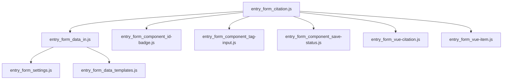

# Documentation for Javascript of SR input form

## Module architecture

## Module descriptions

### entry_form_citation.js

_The main initialization routines_

#### main()

- Get initial item/referent display selector from URL
- Get the data structure to pass to Vue
  - Load the source data ( call `getSourceData()`)
  - Set currentItemId (initial item to display): either from URL, or the first item, or undefined
- If item specified in URL, select tab
- Initialize forms in Vue (call `initializeSourceForm()` and `initializeItemForm()`)

### entry_form_data_in.js

Exports:

- getSourceData
- getItemData
- getRelationshipsData

#### getSourceData()

Fetches from API, merges it with `LOCAL_SETTINGS` data structure, then calls `preprocessSourceData()`

#### 

### entry_form_vue-citation.js

_Exports `initializeSourceForm`. Main `Vue` call; passing `dataAndSettings` as a parameter, calls `Vue` to initialize the markup._

Functions:

- updateSourceFieldVisibility()
- saveSourceToServer()
- initializeSourceForm()

#### initializeSourceForm()

- Calls `Vue()`
- Watch for changes in citation type; update citation field visibility on change (calls `updateSourceFieldVisibility()`)

#### updateSourceFieldVisibility()

Routine to hide/unhide source citation fields based on the document type. 

#### saveSourceToServer()

Defines main routine for saving a Source (citation data) to the DB.

### entry_form_settings.js

Main settings file. Includes (among other things) the values for some menu items. Gets merged into the data structure available to Vue.

### entry_form_data_templates.js

These are the definitions of 'blank' data structures

They're necessary in part because Vue likes to have all the properties defined upon creation, which doesn't mix well with incremental enhancement (which is the way that the API works).

Also, they're useful when creating a blank entry to create a new record